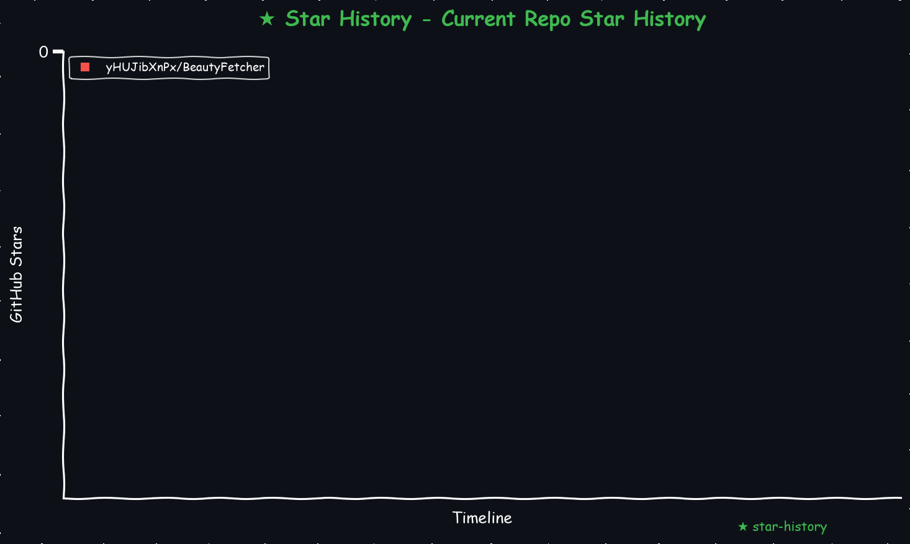

# BeautyFetcher
Python 脚本获取 24fa 凸凹吧 24fam xerocos.com mitaku.net meiru.neocities.org fuligirl.top 和 photos18.com 美女图片下载

    
<!-- <a href="https://star-history.com/#yHUJibXnPx/BeautyFetcher&Date">
  <picture>
    <source media="(prefers-color-scheme: dark)" srcset="https://api.star-history.com/svg?repos=yHUJibXnPx/BeautyFetcher&type=Date&theme=dark" />
    <source media="(prefers-color-scheme: light)" srcset="https://api.star-history.com/svg?repos=yHUJibXnPx/BeautyFetcher&type=Date" />
    
  </picture>
</a> -->
<!-- START_STAR_HISTORY_SELF -->

<!-- END_STAR_HISTORY_SELF -->

# 目录结构：
    .
    ├── 24fa爬美图.py                                # 24fa 链接的Python脚本  
    ├── 24MM爬美图.py                                # 24fam 链接的Python脚本  
    ├── dedup_medias.py                             # dedup_medias 针对多源同一文件去重脚本  
    ├── xerocos.com爬美图.py                         # xerocos.com 链接的Python脚本  
    ├── mitaku.net爬美图.py                          # mitaku.net 链接的Python脚本  
    ├── meiru.neocities.org爬美图.py                 # meiru.neocities.org 链接的Python脚本  
    ├── fuligirl.top爬美图.py                        # fuligirl.top 链接的Python脚本  
    ├── photos18.com爬美图.py                        # photos18.com 链接的Python脚本  
    ├── 凸凹吧爬美图.py                               # 凸凹吧 链接的Python脚本  
    ├── requestment.txt                             # Python脚本所需依赖  
    ├── make_star_chart.py                          # 生成 星星统计 脚本  
    ├── LICENSE                                     # TIM 协议  
    └── README.md                                   # 这个是说明文件   

# 图片校验代码测试部分代码
```python
import io # (新增) 用于从内存中读取 bytes
import logging
import requests
from requests.adapters import HTTPAdapter
from typing import Optional
# -------- (新增) 检查 Pillow 库 --------
try:
    from PIL import Image, ImageFile
    from PIL.Image import UnidentifiedImageError
    ImageFile.LOAD_TRUNCATED_IMAGES = True
    Image.MAX_IMAGE_PIXELS = None
    PILLOW_AVAILABLE = True
except ImportError:
    PILLOW_AVAILABLE = False
if not PILLOW_AVAILABLE:
    logging.warning("Pillow 库未安装。将跳过严格的图像完整性校验 (请运行: pip install Pillow)")
# -------- 日志设置 --------
logging.basicConfig(level=logging.INFO, format="%(asctime)s - %(levelname)s - %(message)s")
DEFAULT_POOL_SIZE = 64           # (已存在) 连接池大小

# -------- (新增) 图像验证辅助函数 (已优化) --------
def is_image_valid_file(filepath: str) -> bool:
    """[优化] 检查磁盘上的文件是否为有效图像。"""
    #try:
    #    file_size = os.path.getsize(filepath)
    #    if file_size < (args.min_size * 1024): # (已修正)
    #        return False
    #except OSError:
    #    return False

    # 2. 强校验 (Pillow)
    if PILLOW_AVAILABLE:
        try:
            with Image.open(filepath) as img:
                img.verify() # 检查文件是否截断或损坏
                logging.info("Pillow 校验类型: %s", img.format)
            return True
        # 由于保留未知格式是如此的不现实，只好宁缺毋滥了
        ## (优化) 区分“无法识别”和“确认损坏”
        #except UnidentifiedImageError:
        #    # 格式无法识别 (可能是 AVIF, HEIC 等新格式)
        #    # 我们选择“信任”它，只要它的大小达标 (上面已检查)
        #    logging.warning("Pillow 无法识别 %s (可能为新格式)，已跳过强校验。", filepath)
        #    return True # 既然大小合格，Pillow不认识，我们就放行
        except (UnidentifiedImageError, ValueError, OSError, TypeError) as e:
            # 确定的损坏 (例如 "Truncated file", "bad string")
            # 这也包括了Pillow试图解析HTML时抛出的错误
            logging.debug("Pillow 校验失败 (内容确认损坏或为HTML): %s", e)
            return False
        except Exception as e:
            # 其他未知异常
            logging.error("校验文件 %s 时发生未知异常: %s", filepath, e)
            return False
            
    return True
def is_image_valid_bytes(data: bytes) -> bool:
    """[优化] 检查内存中的 bytes 是否为有效图像。"""
    # 1. 基础检查: 大小
    #if len(data) < (args.min_size * 1024):
    #    logging.warning("验证失败 (内容太小 %dKB)", len(data) // 1024)
    #    return False
    
    # 2. 强校验 (Pillow)
    if PILLOW_AVAILABLE:
        try:
            # 从 bytes 打开
            with Image.open(io.BytesIO(data)) as img:
                img.verify() # 检查文件是否截断或损坏
                logging.info("Pillow 校验类型: %s", img.format)
            return True
        # 由于保留未知格式是如此的不现实，只好宁缺毋滥了
        ## (优化) 区分“无法识别”和“确认损坏”
        #except UnidentifiedImageError:
        #    # 格式无法识别 (可能是 AVIF, HEIC 等新格式)
        #    # 我们选择“信任”它，只要它的大小达标 (上面已检查)
        #    logging.warning("Pillow 无法识别 %s (可能为新格式)，已跳过强校验。", filepath)
        #    return True # 既然大小合格，Pillow不认识，我们就放行
        except (UnidentifiedImageError, ValueError, OSError, TypeError) as e:
            # 确定的损坏 (例如 "Truncated file", "bad string")
            # 这也包括了Pillow试图解析HTML时抛出的错误
            logging.debug("Pillow 校验失败 (内容确认损坏或为HTML): %s", e)
            return False
        except Exception as e:
            logging.error("验证时发生系统级异常: %s", e)
            return False
            
    return True
def make_session() -> requests.Session:
    """(已存在) 创建并配置requests.Session，增加连接池大小。"""
    s = requests.Session()
    s.headers.update({
        "User-Agent": "Mozilla/5.0 (Windows NT 10.0; Win64; x64) AppleWebKit/537.36 (KHTML, like Gecko) Chrome/126.0.0.0 Safari/537.36",
    })
    
    # 配置连接池适配器
    adapter = HTTPAdapter(
        pool_connections=DEFAULT_POOL_SIZE,  # 连接池的最大数量
        pool_maxsize=DEFAULT_POOL_SIZE       # 保持活动的连接数
    )
    # 为 http 和 https 协议都挂载这个适配器
    s.mount('http://', adapter)
    s.mount('https://', adapter)
    
    return s
def request_binary(session: requests.Session, url: str, retries: int, timeout: int) -> Optional[bytes]:
    """(强化) 请求二进制文件(图片)，带重试、指数退避和 429/UnboundLocalError 修复。"""
    r: Optional[requests.Response] = None # 修复 UnboundLocalError
    for attempt in range(1, retries + 1):
        try:
            r = session.get(url, timeout=timeout, stream=True)
            r.raise_for_status() # 检查 4xx/5xx 错误
            return r.content
            
        except RequestException as e:
            wait_time = min(30, (2 ** attempt) * 0.4) + random.random()
            status_msg = f"{r.status_code}" if r is not None else "无响应"

            if r is not None and r.status_code == 429 and attempt < retries:
                logging.warning("图片请求失败: %s (尝试 %d/%d) 错误: %s。遭遇 429，等待 %.1fs。", 
                                url, attempt, retries, e, wait_time * 2)
                time.sleep(wait_time * 2)
            elif attempt < retries:
                logging.warning("图片请求失败: %s (尝试 %d/%d) 错误: %s。状态: %s，等待 %.1fs 并重试。", 
                                url, attempt, retries, e, status_msg, wait_time)
                time.sleep(wait_time)
            else:
                logging.error("图片请求失败: %s (所有尝试均失败)。错误: %s", url, e)
    return None

# 本地文件测试
file_path='90b233ea67fffff05c7135ce7ae9899c199b3800.png'
is_image_valid_file(file_path)

# 创建 session
session = make_session()
# 检测数据流
url = 'https://avatars.githubusercontent.com/u/206320576?s=400&u=90b233ea67fffff05c7135ce7ae9899c199b3800&v=4'
data = request_binary(session, url, retries=3, timeout=5)
is_image_valid_bytes(data)
```
# 注意：
xerocos.com meiru.neocities.org 美图网挂了，哎可惜了  
~24fa.com 被人攻击了无法运营了，302 跳转到 `凸凹吧` 并由其替代了，太可惜了，美好的事物最终都会离我而去吗？~  

# 声明
本项目仅作学习交流使用，用于解决生理需求，学习各种姿势，不做任何违法行为。仅供交流学习使用，出现违法问题我负责不了，我也没能力负责，我没工作，也没收入，年纪也大了，你就算灭了我也没用，我也没能力负责。
